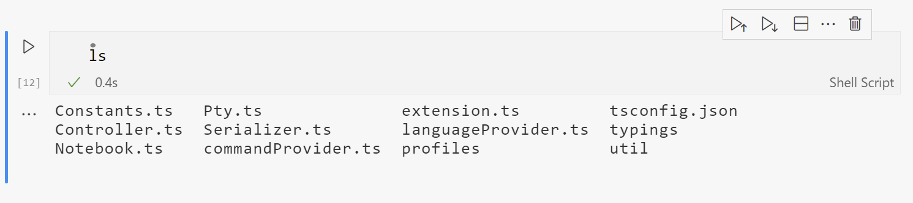
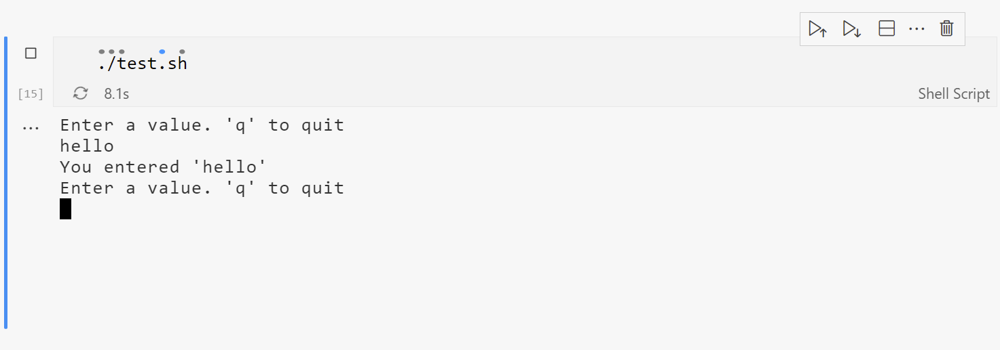

# BashBook

Notebook for running bash/shell script



## Creating a BashBook

BashBook the way you would any normal notebook

1. Open a file with the `.bashbook` extension
1. New File... / `Bash Notebook`
1. Command / `BashBook: Create new Bash Notebook`

## Commands

- Create new Bash Notebook
- Open notebook as markdown
- Open all outputs in new file
- Execute cell and select content
- Execute cell and clear content
- Execute and show output in below markdown cell
- Clear cell content and edit
- Copy cell output
- Open cell output in new file

## Details

### One shell per notebook

Each notebook is running one continuous shell. This means that commands running in one cell will effect the others. Only one execution is allowed at the time and the rest is queued.

### Interactive terminal (prompt)

Interaction with running execution is possible in the output terminal. Finished executions are non-interactive.



### Resize

- Resizes terminal height to fit content dynamically
- Resizes terminal width at end of execution. Only affects next execution.

### Current Working Directory(CWD)

Tries to set CWD in following order

1. File directory
1. Workspace directory
1. User home directory

## Build details

### Build local

```
npm install
npm run compile
```

### Components

- node-pty
- xterm.js

### Rebuild node-pty with correct electron version

If you get an error `NODE_MODULE_VERSION` mismatch run the following:

```
node_modules/.bin/electron-rebuild -w node-pty
```
